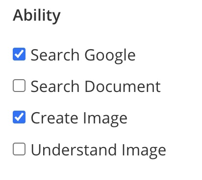

# Using Tools in UClone - Level Up Your AI Clones!

Want to create an AI clone that can do *more* than just chat? UClone tools are the key! They give your clone superpowers, letting it connect to the real world and get things done. This guide shows you how to unlock those powers.

## Getting Started with Abilities:

Abilities are the core of your clone's power-ups. You'll find these options in the Clone Studio when creating or editing your clone, under "Advanced Settings."  Keep in mind, some abilities depend on your UClone subscription.  Each ability empowers your clone with specific tools.

## Available Abilities and Their Corresponding Tools:

* **Search Google:** Enables the `search_web_google` tool, allowing your clone to search the web for information using Google Search.

* **Search Document:** Enables the `search_local_document` tool, allowing your clone to search through the documents you've uploaded as knowledge in the Clone Studio.

* **Create Image:** Enables the `generate_image` tool, unleashing your clone's artistic side by generating images from text descriptions.

* **Understand Image:** Enables the following tools for image analysis:
    * `describe_image`: Allows your clone to describe the content of images.
    * `extract_text`: Enables your clone to extract text from images.

## Making the Most of Your Abilities - Clear Instructions are Key:

Just like giving directions, the clearer your instructions in the prompt, the better your clone will perform.  Tell your clone *when* to use a specific tool by referencing the ability it's linked to.

### Examples:

* To search the web using `search_web_google`: "You have to use the search_web_google tool when a user asks about the latest news."

* To generate an image using `generate_image`: "When the user asks for an image, use the generate_image tool. For example, if the user says 'Create an image of a cat playing a piano', generate an image of a cat playing a piano."

## Need Help?

Hit up the UClone Help Desk: [https://chat.uclone.net/uclone/messages/@uclone_help_desk](https://chat.uclone.net/uclone/messages/@uclone_help_desk)

